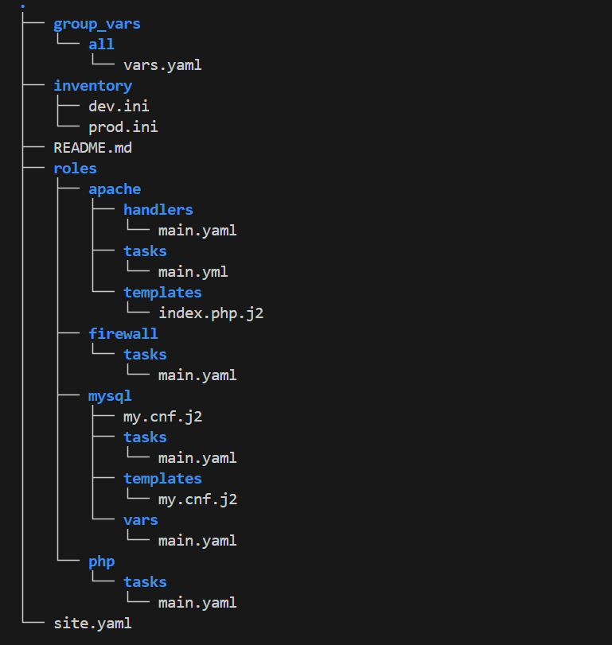
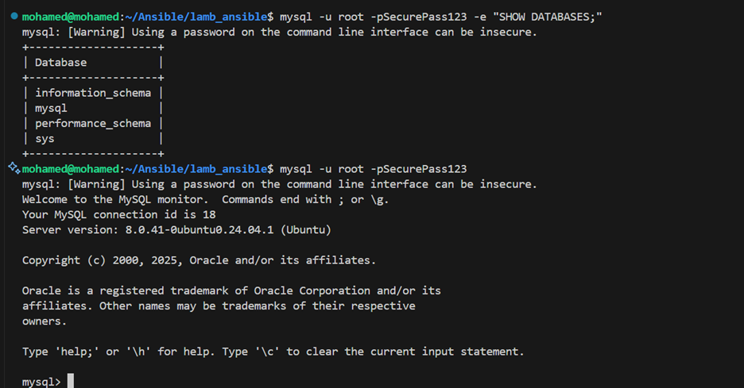
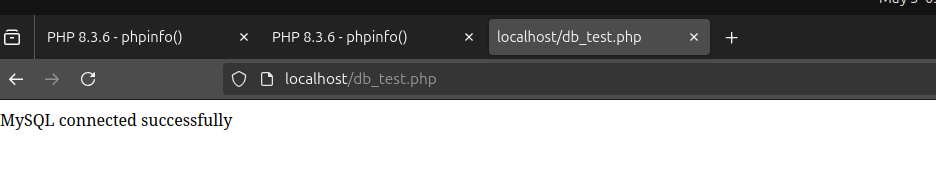
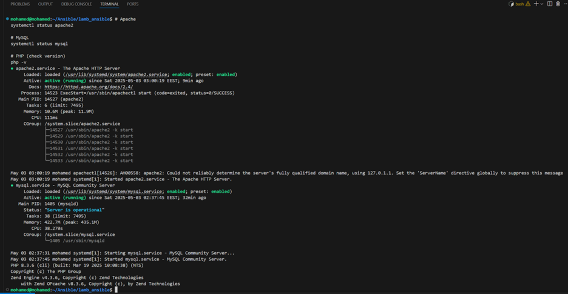
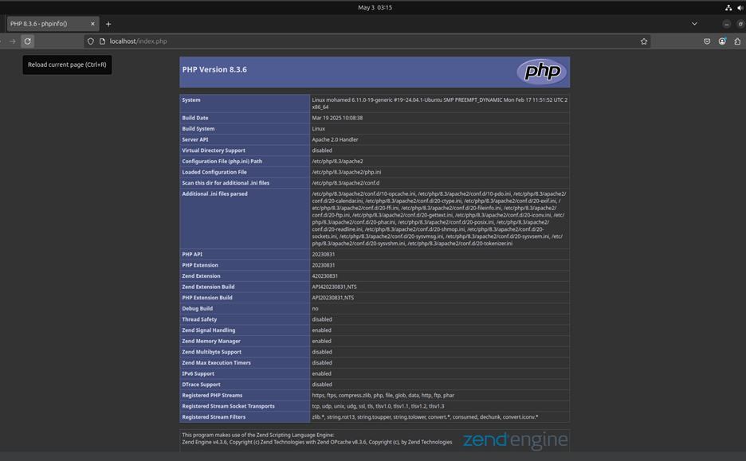
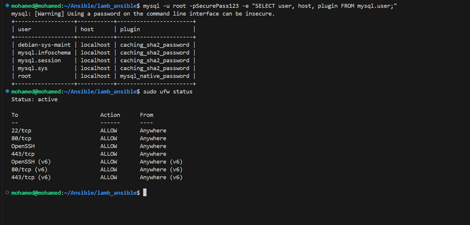

# LAMP Stack Deployment with Ansible

🚀 Automated LAMP (Linux, Apache, MySQL, PHP) Stack Deployment using Ansible for seamless server provisioning and configuration.

## 📌 Project Overview

This Ansible project automates the deployment of a LAMP (Linux, Apache, MySQL, PHP) stack on Ubuntu/Debian servers. It ensures:
✅ Fast & Consistent Setup – Deploy a fully configured LAMP stack in minutes.  
✅ Idempotent Playbooks – Safe to rerun without unintended side effects.  
✅ Security Best Practices – Secures MySQL, configures firewalls, and removes default test databases.  
✅ Modular Structure – Roles for Apache, MySQL, PHP, and Firewall for easy customization.  

## 🛠️ Features

🔹 Apache Web Server – Installed & configured with a default index.php.  
🔹 MySQL Database – Secured with root password, anonymous user removal, and test DB cleanup.  
🔹 PHP Support – Configured with Apache module for dynamic web content.  
🔹 Firewall (UFW) – Allows HTTP (80), HTTPS (443), and SSH (22) while blocking unnecessary ports.  

## 📸 Screenshots


## 📂 Project Structure


### 🐬 MySQL Configuration



### 🐬 MySQL Connection




### 🔧 Apache Installation



### 🐘 PHP Integration


### 🔒 Firewall Rules



```

## ⚡ Quick Start

### 1️⃣ Prerequisites
- Ansible (≥ 2.9)  
- Ubuntu/Debian target servers  
- SSH access with sudo privileges  

### 2️⃣ Clone & Configure
```bash
git clone https://github.com/yourusername/lamp-ansible.git
cd lamp-ansible
```

### 3️⃣ Edit Inventory & Variables
Update `inventory/production.ini` with your server IPs.  
Set variables in `group_vars/all/vars.yaml`:
```yaml
mysql_root_password: "{{ vault_mysql_password }}"  # Use Ansible Vault
```

### 4️⃣ Run the Playbook
```bash
ansible-playbook -i inventory/production.ini site.yaml --ask-become-pass
```
For Vault-Encrypted Passwords:
```bash
ansible-playbook -i inventory/production.ini site.yaml --ask-vault-pass --ask-become-pass
```

## 🔒 Security Notes
- **MySQL Hardening**: Removes anonymous users and test databases.  
- **Firewall Rules**: Only allows essential ports (HTTP/HTTPS/SSH).  
- **Ansible Vault**: Store secrets in `group_vars/all/vault.yaml` (encrypted).  

## 🚨 Troubleshooting

| Issue                  | Solution                                      |
|------------------------|-----------------------------------------------|
| MySQL Access Denied    | Check `/var/log/mysql/error.log`             |
| Apache Not Serving PHP | Verify `libapache2-mod-php` is installed      |
| UFW Blocking Traffic   | Temporarily disable with `sudo ufw disable` (debug only) |

## 📜 License

MIT License – Free to use, modify, and distribute.

## 🔗 GitHub

[GitHub Repository](https://github.com/Mohamed-Magdy-Dewidar/lamp-ansible)

---

🚀 **Happy Deploying!** 🚀
